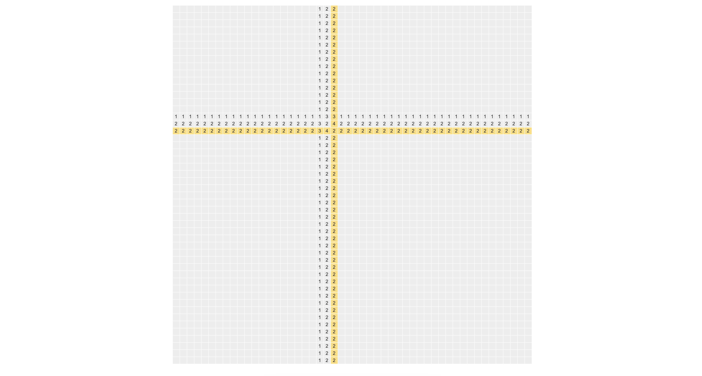

# Fibgrid


Live demo: https://tmw.github.io/fibgrid/

## Running the project

**Clone**

```bash
git clone git@github.com:Tmw/fibgrid.git && cd fibgrid
```

**Dependencies**

```bash
npm i
```

**Test**

```bash
npm run test
```

**Lint**

```bash
npm run lint
```

**Serve**

```bash
npm run serve
```

## Objective

Create a grid of 50x50. When you click on a cell, all values in the cells in the same row and column are increased by 1. If a cell is empty, it will get a value of 1. After each change a cell will briefly turn yellow. If 5 consecutive numbers in the Fibonacci sequence are next to each other, these cells will briefly turn green and will be cleared.

## License

[MIT](./LICENSE)
